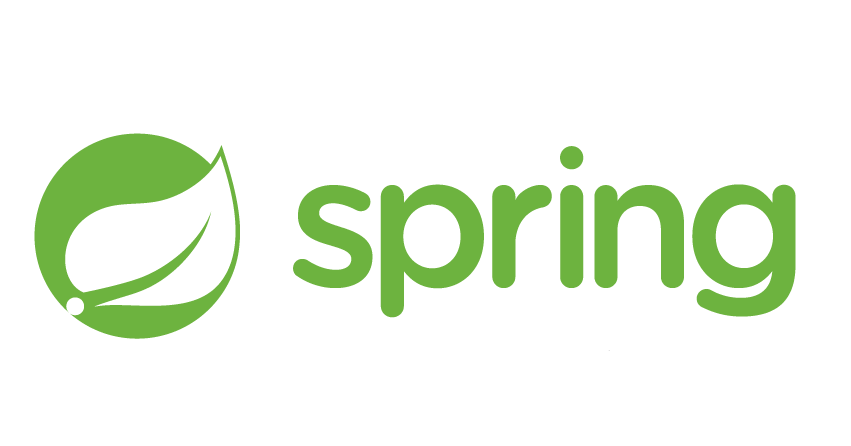

  

🧐 주니어 개발자 <strong>강휴일</strong>입니다. 
EMAIL : holiday.k1@icloud.com 
BLOG : https://hyuil.tistory.com/  
  NOTION  https://www.notion.so/hyuil/cf625f8928c84daf96a7f2a8cf6104c1?pvs=4  
  
  <h2>SKILL</h2>
  
  
    
  <h3>👀 진행한 프로젝트</h3> 
  <strong>태그 메모 서비스</strong>  <a href="https://github.com/h0l1da2/MEMO-RE_BE">MEMO:RE</a>  
  <strong>팬 페이지</strong>  <a href="https://github.com/h0l1da2/always_also_holiday">오늘도 휴일</a>  
  <strong>여행 서비스</strong>  <a href="https://github.com/h0l1da2/with_huyil">위드휴일</a>  
  <strong>(개발중) 크롤링 프로그램</strong>  <a href="https://github.com/h0l1da2/Hyurawling">휴롤링</a>  

  
    

